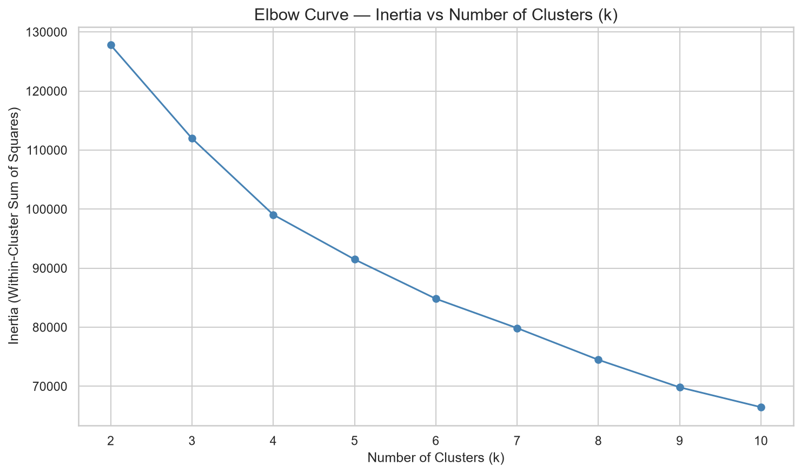
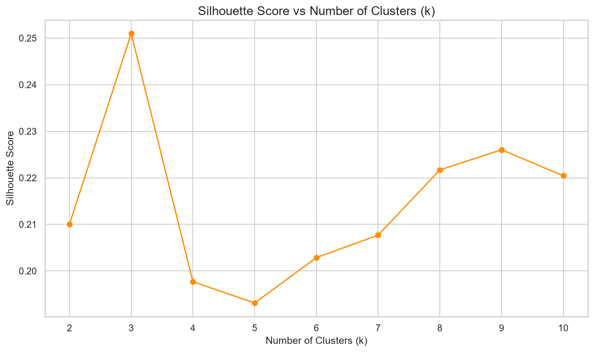
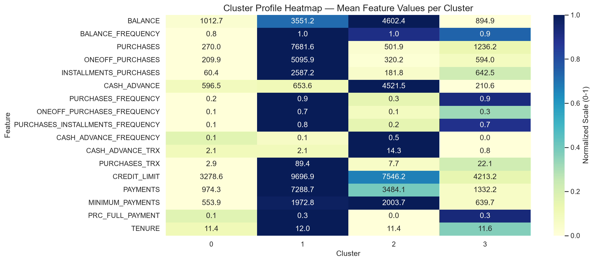
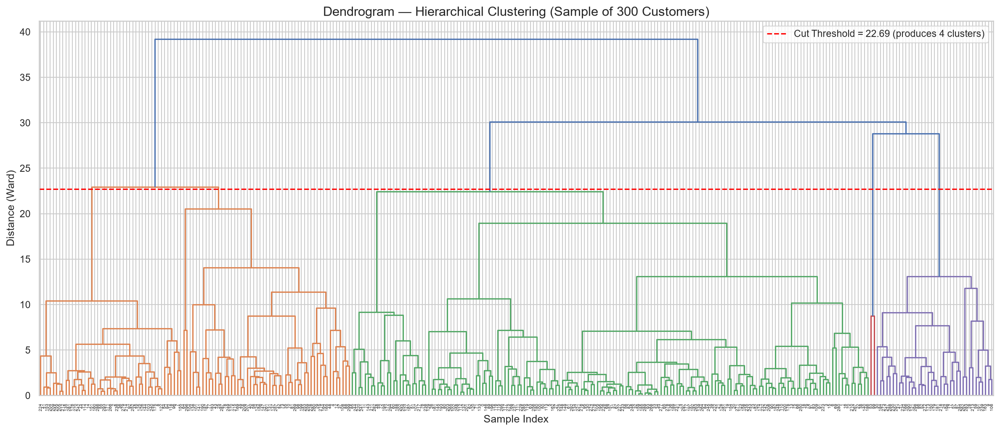
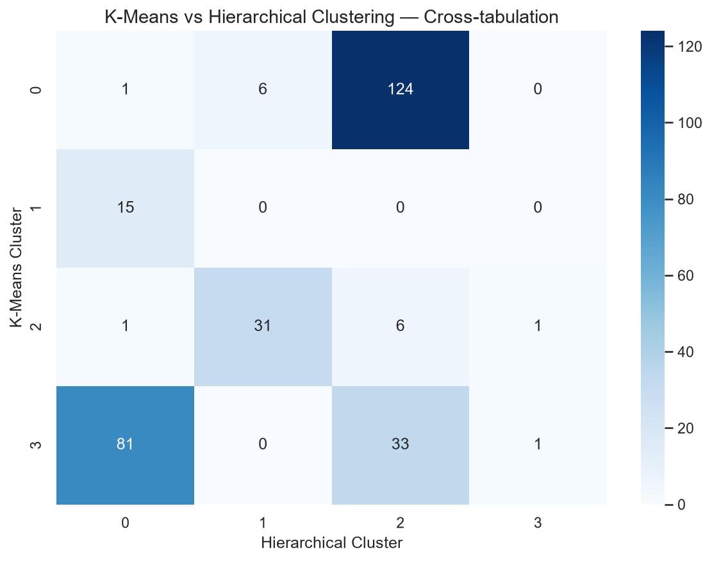

# Credit Card Customer Segmentation — Week 4 Task

## Overview
This project applies **unsupervised machine learning** to segment ~9,000 credit card holders into meaningful behavioral groups, using 6 months of spending, payment, and cash advance data. Unlike previous weeks (which involved predicting a known target value), this task has **no target column** — the goal is to discover hidden, natural groupings in customer behavior that a business can act on for marketing, risk management, and personalization.

Two clustering approaches are used and compared: **K-Means Clustering** and **Agglomerative Hierarchical Clustering**.

## Dataset
- **Name:** Credit Card Dataset for Clustering
- **Source:** Kaggle — https://www.kaggle.com/datasets/arjunbhasin2013/ccdata
- **Records:** 8,950 active credit card holders, 18 behavioral features (balance, purchase patterns, cash advance usage, credit limit, and payment history)
---

## Part 1 — K-Means Clustering

### What was done
- Loaded the dataset and dropped `CUST_ID`, since it is a unique identifier and not a behavioral feature
- Handled missing values in `CREDIT_LIMIT` (1 missing) and `MINIMUM_PAYMENTS` (313 missing) using **median imputation** — chosen over the mean because payment/credit data is typically right-skewed, and over dropping rows to avoid losing ~3.5% of customers
- Scaled all features using `StandardScaler`, which is **mandatory for clustering**: distance-based algorithms like K-Means would otherwise let high-magnitude features (like `CREDIT_LIMIT`, in the thousands) dominate over smaller-scale features (like purchase frequency, between 0 and 1)
- Ran K-Means for k = 2 to 10 and recorded the inertia (within-cluster sum of squares) for each

**Elbow Curve** — used to visually identify the point of diminishing returns as k increases:



- Also calculated the **Silhouette Score** for each k to validate the choice statistically:



- The Silhouette Score peaked at k=3, but the elbow curve showed a more meaningful bend around k=4–5. Balancing statistical signal with business interpretability, **k=4** was selected as the final number of clusters.
- Profiled each cluster by computing the mean of every feature per cluster, visualized as a heatmap:



### Cluster Summary

| Cluster | Segment | Description |
|---|---|---|
| 0 | Low-Activity / Inactive | Modest balance, very low purchase activity, rarely uses the card |
| 1 | High Spenders / Premium | Highest purchases, credit limit, and payments — the bank's most valuable customers |
| 2 | Cash Advance Users (High Risk) | Highest balance and cash advance usage, never pays in full — financially risky |
| 3 | Frequent Installment Shoppers | Low balance, high installment purchase frequency, low risk |

**Business takeaway:** High spenders (Cluster 1) are prime candidates for premium rewards, while cash advance users (Cluster 2) should be flagged for risk monitoring and targeted repayment plans.

---

## Part 2 — Hierarchical Clustering

### What was done
- Applied **Agglomerative Hierarchical Clustering** (Ward's method) on a random sample of 300 rows from the scaled dataset, since hierarchical clustering scales poorly to the full ~9,000-row dataset
- Plotted a **dendrogram** showing how points merge at increasing distances, with a threshold line marking the cut for 4 clusters (matching Part 1):



- Applied `AgglomerativeClustering` from scikit-learn with the same k=4, and compared its cluster assignments against K-Means using a cross-tabulation:



### Comparison Findings
- Strong agreement was found for 3 of the 4 clusters (94.7%–100% overlap), but one K-Means cluster split across two Hierarchical clusters, and Hierarchical Clustering produced one very small (2-point) cluster — likely isolating outliers rather than forming a meaningful group.
- **K-Means is recommended** for real-world deployment: it scales efficiently to the full customer base, produces balanced cluster sizes, and its centroids can easily classify new customers as they join. Hierarchical Clustering remains useful as a complementary, exploratory tool for validating the chosen number of clusters via the dendrogram.

---

## How to Run

```bash
pip install -r requirements.txt
jupyter notebook notebooks/week4_clustering.ipynb
```

## Author
Musfira Malik — AI/ML Internship
